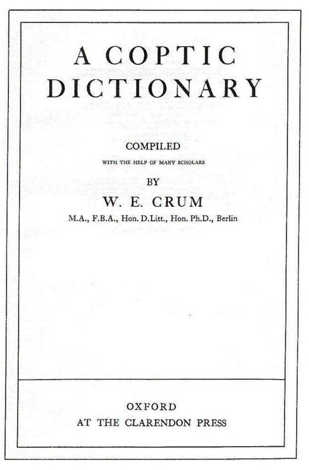

# Crums Coptic Dictionary (Database)

> The first searcheable digitization of *Crum's Coptic Dictionary*, providing a free API for consumption. This project is still in development and not yet in production.

### Table of Contents

- [Description](#description)
- [Deploy the App](#Deploy)
- [Resources](#Resources)
    - [Application Controller](#Application)
    - [Chapter Controller](#Chapters)
    - [Entrey Controller](#Entries)
    - [Meaning Controller](#Meanings)
    - [Reference Controller](#References)
- [Contributing](#Contributing)
- [Code of Conduct](#Conduct)
- [Maintainers](#Maintainer(s))
- [License](#license)

---

## Description

This project was created to make the first searcheable instance of a digitized version of *Crum's Coptic Dictionary*. To date, the volume has only been scanned into pdf, and those have not even been scanned with suitable *OCR* options.

This application provides a consumable API that allows access to a digitized version of *Crum* that is fully searchable, allowing for lemma searches, corpus searches, word frequency, and Crum's noted equivalency to target languages (Syriac, Greek, Hebrew, and Arabic).

The *Dictionary* was digitized using object-oriented programming. The database tables and corresponding models in Rails represent attributes and sections of a philological lexicon.

The schematic for the relationship of these models [can be viewed here.](./.drawio))

### Technologies
- Ruby
- Rails
- Rspec
- Postgresql

## Deploy
---

Instructions Forthcoming

## Resources
For public consumption, there will not be CRUD actions reflected in the endpoints. The API will be read-only and the endpoints will look like the following:

### Application
| route | method | description | Docs |
|---|---|---|---|
|  '/' | GET | renders welcome page |  [code](./app/controllers/pplication_controller.rb#L1) |
---

### Chapters
| route | methods | description | Docs |
|---|---|---|---|
|  '/chapters' | GET | index, all chapter instances | [code](./app/controllers/chapters_controller.rb#L3-L15) |
|  '/chapters/:id' | GET | shows an instance of a chapter | [code](./app/controllers/chapters_controller.rb#L3-L15) |
|  '/chapters/:id/entries' | GET | shows all entries within a chapter | [code](./app/controllers/chapters_controller.rb#L3-L15) |
---
### Entries
| route | methods | description | Docs |
|---|---|---|---|
|  '/entires/:id' | GET | shows individual entry instance |  [code](./app/controllers/entries_controller.rb#L3-L13) |
|  '/chapters/:id/entries/:id' | GET | shows individual entry instance nested within parent chapter route| [code](./app/controllers/entries_controller.rb#L3-L15) |
---
### Meanings
|  route | Methods | description  |  Docs |
|---|---|---|---|
|  '/meanings/:id' | GET | shows individual meaning entry instance |  [code](./app/controllers/meanings_controller.rb#L3-L13) |
|  '/entries/:id/meanings/:id' | GET | shows individual meaning within parent entry route |  [code](./app/controllers/meanings_controller.rb#L3-L13) |
---
### References
|  route | Methods | description  |  Docs |
|---|---|---|---|
|  '/references' | GET | shows all textual references |  [code](./app/controllers/references_controller.rb#L3-L13) |
|  '/references/:id' | GET | shows individual meaning entry instance |  [code](./app/controllers/references_controller.rb#L3-L13) |

## Contributing
---

Bug reports and pull requests are welcome on GitHub at https://github.com/tmtarpinian/crums-coptic-dictionary-db. This project is intended to be a safe, welcoming space for collaboration, and contributors are expected to adhere to the [Contributor Covenant](http://contributor-covenant.org) code of conduct.

## Conduct
---

Everyone using and interacting in Crums's Coptic Dictionary codebases, issue trackers, chat rooms and/or mailing lists is expected to follow the [code of conduct](./CODE_OF_CONDUCT.md).

## Maintainer(s)
---

|      |
| :------------- | 
|[@tmtarpinian](https://github.com/tmtarpinian) |

## License
Copyright © 2020 Trevor Tarpinian

The app is available as open source under the terms of the [MIT License](https://opensource.org/licenses/MIT).

## Addendum
### Formatting Decisions and Rationale
Since digitizing this project no longer constrains us to fit data within the limits of a physical page, it allows the opportunity to reduce abbreviations, hopefully mitigating confusion arising from more obscure abbreviations as well as making data more searcheable.

I did not want to take liberties with Crum's work, and worked to maintain his formatting as much as possible.

1. I did update biblical refererences to conform to SBL style standards
2. I kept the references to primary source abbreviated following Crum
3. I wrote out all Coptic, removing abbreviations. I did this to improve searchability and reduce false-positives in querying later. For example:
    - I've written out suffixes as part of the lexeme
        - For ⲕⲁⲗⲁϩⲏ, I've written out ⲕⲁⲗⲁϩⲏ ⲉⲃⲟⲗ as and entry (p. 107)
4. 